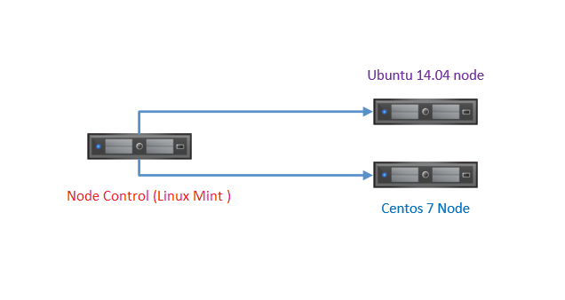

## Mô hình lab 

 

## Cài đặt Ansible trên Control Server 
	sudo apt-get update
	sudo apt-get install ansible=2.0.0.2-2ubuntu1

### Kiểm tra phiên bản Ansible đã cài
	trieu@kma ~ $ ansible --version
	ansible 2.0.0.2
	  config file = /etc/ansible/ansible.cfg
	  configured module search path = Default w/o overrides

### Tạo file hosts và thêm các hosts cần quản lý 
	trieu@kma ~ $ vi hosts 

	[hosts]
	192.168.188.128 #cent0s
	192.168.188.129 #Ubuntu

### Tạo user và cấp quyền sudo cho các user ở các host ( kể cả node control)  
	adduser trieu
	passwd trieu

	Adding user 'trieu' ...
	Adding new group 'trieu' (1002) ...
	Adding new user 'trieu' (1002) with group 'trieu' ...
	Creating home directory '/home/trieu' ...
	Copying files from '/etc/skel' ...
	Enter new UNIX password: 
	Retype new UNIX password: 
	passwd: password updated successfully
	Changing the user information for trieu
	Enter the new value, or press ENTER for the default
		Full Name []: 
		Room Number []: 
		Work Phone []: 
		Home Phone []: 
		Other []: 
	Is the information correct? [Y/n] : y 

Cấp quyền sudo cho user

	visudo

- thêm vào bên dưới root

		%trieu ALL=(ALL) NOPASSWD:ALL

### Tạo keygen trên node control sau đó gửi tới các host, nhằm mục đích ssh tới các host mà không phải xác thực bằng mật khẩu

	trieu@kma ~ $ ssh-keygen
	Generating public/private rsa key pair.
	Enter file in which to save the key (/home/trieu/.ssh/id_rsa): 
	/home/trieu/.ssh/id_rsa already exists.
	Enter passphrase (empty for no passphrase): 
	Enter same passphrase again: 
	Your identification has been saved in /home/trieu/.ssh/id_rsa.
	Your public key has been saved in /home/trieu/.ssh/id_rsa.pub.
	The key fingerprint is:
	SHA256:BYqVYGS+aygVkFpgy1CTtnx4pKy1Na5EMJiACzAcZ5E trieu@kma
	The key's randomart image is:
	+---[RSA 2048]----+
	|&B+*B....        |
	|%+BE.o.. .       |
	|o@.=o .   .      |
	|o O.=.   .       |
	| +.*..  S        |
	|..o...           |
	|....o            |
	| ...             |
	|                 |
	+----[SHA256]-----+

<b>Gửi tới các host</b>

	 trieu@kma ~ $ ssh-copy-id trieu@192.168.188.128
	 trieu@kma ~ $ ssh-copy-id trieu@192.168.188.129

- node Cent0s

		trieu@kma ~ $ ssh-copy-id trieu@192.168.188.128
		/usr/bin/ssh-copy-id: INFO: attempting to log in with the new key(s), to filter out any that are already installed
		/usr/bin/ssh-copy-id: INFO: 1 key(s) remain to be installed -- if you are prompted now it is to install the new keys
		trieu@192.168.188.128's password: 
		
		Number of key(s) added: 1
		
		Now try logging into the machine, with:   "ssh 'trieu@192.168.188.128'"
		and check to make sure that only the key(s) you wanted were added.

- node Ubuntu

		trieu@kma ~ $ ssh-copy-id trieu@192.168.188.129
		/usr/bin/ssh-copy-id: INFO: attempting to log in with the new key(s), to filter out any that are already installed
		/usr/bin/ssh-copy-id: INFO: 1 key(s) remain to be installed -- if you are prompted now it is to install the new keys
		trieu@192.168.188.129's password: 
		
		Number of key(s) added: 1
		
		Now try logging into the machine, with:   "ssh 'trieu@192.168.188.129'"
		and check to make sure that only the key(s) you wanted were added.

Kiểm tra hoạt động của việc xác thực bằng key qua ssh

	 trieu@kma ~ $ ssh trieu@192.168.188.128
	 trieu@kma ~ $ ssh trieu@192.168.188.129

- node Cent0s

		trieu@kma ~ $ ssh trieu@192.168.188.128
		Last login: Wed Mar 29 20:13:30 2017 from 192.168.188.1
		[trieu@localhost ~]$ exit
		logout
		Connection to 192.168.188.128 closed.

- node Ubuntu

		trieu@kma ~ $ ssh trieu@192.168.188.129
		Welcome to Ubuntu 14.04.5 LTS (GNU/Linux 4.4.0-31-generic i686)
		
		 * Documentation:  https://help.ubuntu.com/
		
		  System information as of Wed Mar 29 20:07:13 ICT 2017
		
		  System load:  0.06              Processes:           222
		  Usage of /:   16.8% of 8.50GB   Users logged in:     1
		  Memory usage: 7%                IP address for eth0: 192.168.188.129
		  Swap usage:   0%
		
		  Graph this data and manage this system at:
		    https://landscape.canonical.com/
		
		New release '16.04.2 LTS' available.
		Run 'do-release-upgrade' to upgrade to it.
	
		Last login: Wed Mar 29 20:06:14 2017
		trieu@ubuntu:~$ 

## Sử dụng lệnh đơn giản
Bây giờ đã có đủ điều kiện để kết nối tới các host, ta có thể thử kiểm tra với câu lệnh đầu tiên:

Ping tất cả các host:

	 ansible all -m ping -i hosts

Output:

	 192.168.188.128 | SUCCESS => {
	     "changed": false, 
	     "ping": "pong"
	 }
	 192.168.188.129 | SUCCESS => {
	     "changed": false, 
	     "ping": "pong"
	 }

## Tạo playbook cài đặt telnet cho các host

	vi telnet.yml

	---
	- hosts: all
	  sudo: True
	  user: trieu
	  connection: ssh
	
	  tasks:
	  - apt: name=$item state=latest
	    with_items:
	     - telnet
	    when: ansible_distribution == 'Debian' or ansible_distribution == 'Ubuntu'
	
	  - yum: name=$item state=latest
	    with_items:
	     - telnet
	    when: ansible_distribution == 'CentOS' or ansible_distribution == 'Red Hat Enterprise Linux'

Chạy playbook vừa tạo:

	 ansible-playbook -i hosts telnet.yml

Output:

	  ______
	 < PLAY >
	  ------
	         \   ^__^
	          \  (oo)\_______
	             (__)\       )\/\
	                 ||----w |
	                 ||     ||
	 
	  ______________
	 < TASK [setup] >
	  --------------
	       	 \   ^__^
	          \  (oo)\_______
	             (__)\       )\/\
	                 ||----w |
	                 ||     ||
	 
	 ok: [192.168.188.129]
	 ok: [192.168.188.128]
	  ____________
	 < TASK [apt] >
	  ------------
	         \   ^__^
	          \  (oo)\_______
	             (__)\       )\/\
	                 ||----w |
	                 ||     ||
	 
	 skipping: [192.168.188.128] => (item=[]) 
	 changed: [192.168.188.129] => (item=[u'telnet'])
	  ____________
	 < TASK [yum] >
	  ------------
	         \   ^__^
	          \  (oo)\_______
	             (__)\       )\/\
	                 ||----w |
	                 ||     ||
	 
	 skipping: [192.168.188.129] => (item=[]) 
	 changed: [192.168.188.128] => (item=[u'telnet'])
	  ____________
	 < PLAY RECAP >
	  ------------
	         \   ^__^
	          \  (oo)\_______
	             (__)\       )\/\
	                 ||----w |
	       	         ||     ||
	 
	 192.168.188.128            : ok=2    changed=1    unreachable=0    failed=0   
	 192.168.188.129            : ok=2    changed=1    unreachable=0    failed=0   

