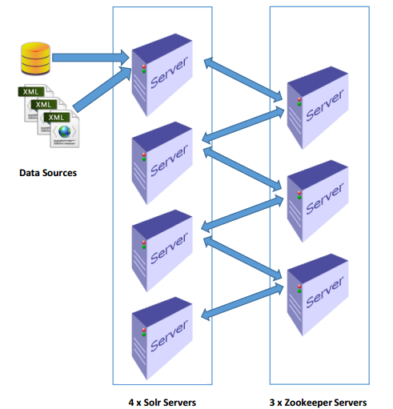
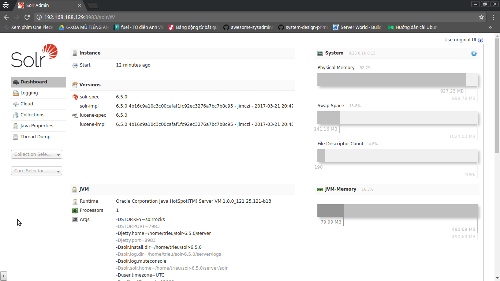
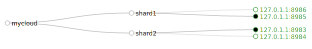
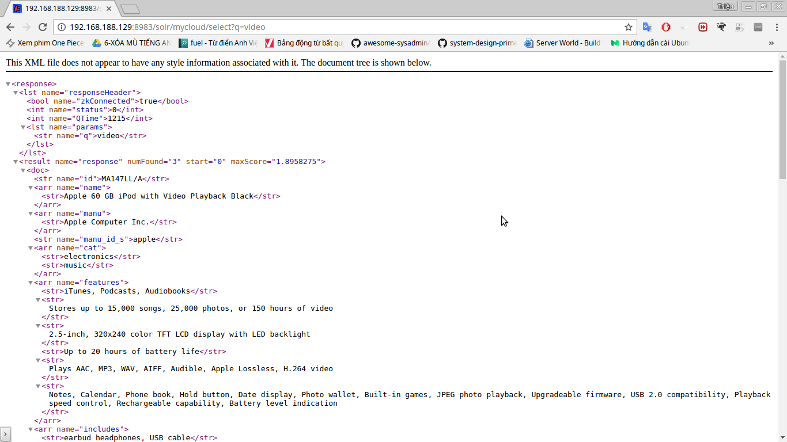

## Mô hình lab

 

Cài đặt trên 1 máy Ubuntu Server 14.04 và chạy ở các cổng khác nhau
## Cài đặt Oracle JAVA 8
	$ sudo add-apt-repository ppa:webupd8team/java
	$ sudo apt-get update
	$ sudo apt-get install oracle-java8-installer

### Kiểm tra phiên bản Java đã cài đặt
	$ java -version 
	
	java version "1.8.0_121"
	Java(TM) SE Runtime Environment (build 1.8.0_121-b13)
	Java HotSpot(TM) 64-Bit Server VM (build 25.121-b13, mixed mode, sharing)

### Thiết lập biến môi trường Java
	$ export JAVA_HOME=usr/lib/jvm/java-8-oracle
	
	trieu@ubuntu:~$ echo $JAVA_HOME 
	/usr/lib/jvm/java-8-oracle

### Cài đặt Apache ZooKeeper
Download tại: https://zookeeper.apache.org/releases.html

Hoặc tải về bằng terminal:

	 trieu@ubuntu:~$ wget http://mirror.downloadvn.com/apache/zookeeper/zookeeper-3.4.8/zookeeper-3.4.8.tar.gz

Giải nén:

	 trieu@ubuntu:~$ tar xzf zookeeper-3.4.8.tar.gz

#### Cấu hình cho các ZooKeeper
	$ cd zookeeper-3.4.8/conf
	$ vi zoo.cfg
	
	dataDir=/home/trieu/zookeeper-data/1
	clientPort=2181
	initLimit=5
	syncLimit=2
	server.1=localhost:2888:3888
	server.2=localhost:2889:3889
	server.3=localhost:2890:3890
	
	$ cp zoo.cfg zoo2.cfg
	$ vi zoo2.cfg
	dataDir=/home/trieu/zookeeper-data/2
	clientPort=2182
	initLimit=5
	syncLimit=2
	server.1=localhost:2888:3888
	server.2=localhost:2889:3889
	server.3=localhost:2890:3890
	
	$ cp zoo.cfg zoo3.cfg
	$ vi zoo3.cfg
	dataDir=/home/trieu/zookeeper-data/3
	clientPort=2183
	initLimit=5
	syncLimit=2
	server.1=localhost:2888:3888
	server.2=localhost:2889:3889
	server.3=localhost:2890:3890

Tạo các thư mục chứa dữ liệu của Zookeeper tương ứng

	 $ mkdir /home/trieu/zookeeper-data
	 $ mkdir /home/trieu/zookeeper-data/1
	 $ mkdir /home/trieu/zookeeper-data/2
	 $ mkdir /home/trieu/zookeeper-data/3
	 $ vi /home/trieu/zookeeper-data/1/myid
	 1
	
	 $ vi /home/trieu/zookeeper-data/2/myid
	 2
	
	 $ vi /home/trieu/zookeeper-data/3/myid
	 3

Viết Shell chạy tự động

	 trieu@ubuntu:~$ cd zookeeper-3.4.8
	 trieu@ubuntu:~/zookeeper$ vi startZookeeper.sh

	 #!/bin/sh
	 bin/zkServer.sh start conf/zoo.cfg
	 bin/zkServer.sh start conf/zoo2.cfg
	 bin/zkServer.sh start conf/zoo3.cfg

	 trieu@ubuntu:~/zookeeper$ chmod +x startZookeeper.sh
	 trieu@ubuntu:~/zookeeper$ cp startZookeeper.sh stopZookeeper.sh
	 trieu@ubuntu:~/zookeeper$ vi stopZookeeper.sh

	 #!/bin/sh
	 bin/zkServer.sh stop conf/zoo.cfg
	 bin/zkServer.sh stop conf/zoo2.cfg
	 bin/zkServer.sh stop conf/zoo3.cfg

	 trieu@ubuntu:~/zookeeper$ ./startZookeeper.sh

	 ZooKeeper JMX enabled by default
	 Using config: conf/zoo.cfg
	 Starting zookeeper ... STARTED
	 ZooKeeper JMX enabled by default
	 Using config: conf/zoo2.cfg
	 Starting zookeeper ... STARTED
	 ZooKeeper JMX enabled by default
	 Using config: conf/zoo3.cfg
	 Starting zookeeper ... STARTED
	
### Cài đặt Apache Solr 
Download tại: http://www.apache.org/dyn/closer.lua/lucene/solr/6.5.0

Hoặc tải về bằng terminal:

	 trieu@ubuntu:~$ wget http://mirror.downloadvn.com/apache/lucene/solr/6.5.0/solr-6.5.0.tgz

Giải nén:

	 trieu@ubuntu:~$ tar xzf solr-6.5.0.tgz

Khởi động:

	 trieu@ubuntu:~$ cd solr-6.5.0/
	 trieu@ubuntu:~/solr-6.5.0$ bin/solr start
	 Waiting up to 180 seconds to see Solr running on port 8983 [|]  
	 Started Solr server on port 8983 (pid=4363). Happy searching!

#### Cấu hình

	trieu@ubuntu:~$ mkdir solr-6.5.0/server/solr2
	trieu@ubuntu:~$ mkdir solr-6.5.0/server/solr3
 	trieu@ubuntu:~$ mkdir solr-6.5.0/server/solr4
	trieu@ubuntu:~$ cp solr-6.5.0/server/solr/solr.xml solr-6.5.0/server/solr2/
	trieu@ubuntu:~$ cp solr-6.5.0/server/solr/solr.xml solr-6.5.0/server/solr3/
	trieu@ubuntu:~$ cp solr-6.5.0/server/solr/solr.xml solr-6.5.0/server/solr4/

Sửa port:

	 trieu@ubuntu:~$ vi solr-6.5.0/server/solr2/solr.xml
	 <int name="hostPort">${jetty.port:8984}</int>

	 trieu@ubuntu:~$ vi solr-6.5.0/server/solr3/solr.xml
         <int name="hostPort">${jetty.port:8985}</int>

	 trieu@ubuntu:~$ vi solr-6.5.0/server/solr4/solr.xml
         <int name="hostPort">${jetty.port:8986}</int>

Viết Shell chạy tự động và kết nối đến các ZooKeeper:

	 trieu@ubuntu:~$ vi solr-6.5.0/startSolr.sh
	 #!/bin/sh
	 bin/solr start -c -s server/solr -p 8983 -z localhost:2181,localhost:2182,localhost:2183 -noprompt
	 bin/solr start -c -s server/solr2 -p 8984 -z localhost:2181,localhost:2182,localhost:2183 -noprompt
	 bin/solr start -c -s server/solr3 -p 8985 -z localhost:2181,localhost:2182,localhost:2183 -noprompt
	 bin/solr start -c -s server/solr4 -p 8986 -z localhost:2181,localhost:2182,localhost:2183 -noprompt

	 trieu@ubuntu:~$ vi solr-6.5.0/stopSolr.sh
	 #!/bin/sh
	 bin/solr stop -c -s server/solr -p 8983 -z localhost:2181,localhost:2182,localhost:2183 -noprompt
	 bin/solr stop -c -s server/solr2 -p 8984 -z localhost:2181,localhost:2182,localhost:2183 -noprompt
	 bin/solr stop -c -s server/solr3 -p 8985 -z localhost:2181,localhost:2182,localhost:2183 -noprompt
	 bin/solr stop -c -s server/solr4 -p 8986 -z localhost:2181,localhost:2182,localhost:2183 -noprompt

	 trieu@ubuntu:~$ chmod +x startSolr.sh
	 trieu@ubuntu:~$ chmod +x stopSolr.sh

Khởi động Solr kết nối đến các ZooKeeper:

	 trieu@ubuntu:~$ cd solr-6.5.0/
	 trieu@ubuntu:~$ cd solr-6.5.0/bin/solr stop -all
	 trieu@ubuntu:~/solr-6.5.0$ ./startSolr.sh
	 Waiting up to 180 seconds to see Solr running on port 8983 [\]  
	 Started Solr server on port 8983 (pid=4789). Happy searching!
	 
	 Waiting up to 180 seconds to see Solr running on port 8984 [-]  
	 Started Solr server on port 8984 (pid=4992). Happy searching!
	 
	 Waiting up to 180 seconds to see Solr running on port 8985 [-]  
	 Started Solr server on port 8985 (pid=5215). Happy searching!
	 
	 Waiting up to 180 seconds to see Solr running on port 8986 [/]  
	 Started Solr server on port 8986 (pid=5411). Happy searching!

Kiểm tra trạng thái:

	 trieu@ubuntu:~/solr-6.5.0$ bin/solr status
	 Found 4 Solr nodes: 
	 
	 Solr process 4992 running on port 8984
	 {
	   "solr_home":"/home/trieu/solr-6.5.0/server/solr2",
	   "version":"6.5.0 4b16c9a10c3c00cafaf1fc92ec3276a7bc7b8c95 - jimczi - 2017-03-21 20:47:12",
	   "startTime":"2017-04-07T13:44:11.443Z",
	   "uptime":"0 days, 0 hours, 1 minutes, 30 seconds",
	   "memory":"45.4 MB (%9.2) of 490.7 MB",
	   "cloud":{
	     "ZooKeeper":"localhost:2181,localhost:2182,localhost:2183",
	     "liveNodes":"4",
	     "collections":"1"}}
	 
	 
	 Solr process 5215 running on port 8985
	 {
	   "solr_home":"/home/trieu/solr-6.5.0/server/solr3",
	   "version":"6.5.0 4b16c9a10c3c00cafaf1fc92ec3276a7bc7b8c95 - jimczi - 2017-03-21 20:47:12",
	   "startTime":"2017-04-07T13:44:26.438Z",
	   "uptime":"0 days, 0 hours, 1 minutes, 16 seconds",
	   "memory":"37.6 MB (%7.7) of 490.7 MB",
	   "cloud":{
	     "ZooKeeper":"localhost:2181,localhost:2182,localhost:2183",
	     "liveNodes":"4",
	     "collections":"1"}}
	 
	 
	 Solr process 5411 running on port 8986
	 {
	   "solr_home":"/home/trieu/solr-6.5.0/server/solr4",
	   "version":"6.5.0 4b16c9a10c3c00cafaf1fc92ec3276a7bc7b8c95 - jimczi - 2017-03-21 20:47:12",
	   "startTime":"2017-04-07T13:44:38.230Z",
	   "uptime":"0 days, 0 hours, 1 minutes, 4 seconds",
	   "memory":"24.7 MB (%5) of 490.7 MB",
	   "cloud":{
	     "ZooKeeper":"localhost:2181,localhost:2182,localhost:2183",
	     "liveNodes":"4",
	     "collections":"1"}}
	 
	 
	 Solr process 4789 running on port 8983
	 {
	   "solr_home":"/home/trieu/solr-6.5.0/server/solr",
	   "version":"6.5.0 4b16c9a10c3c00cafaf1fc92ec3276a7bc7b8c95 - jimczi - 2017-03-21 20:47:12",
	   "startTime":"2017-04-07T13:43:56.657Z",
	   "uptime":"0 days, 0 hours, 1 minutes, 47 seconds",
	   "memory":"74.2 MB (%15.1) of 490.7 MB",
	   "cloud":{
	     "ZooKeeper":"localhost:2181,localhost:2182,localhost:2183",
	     "liveNodes":"4",
	     "collections":"1"}}

Tạo Collection:

	 trieu@ubuntu:~/solr-6.5.0$ bin/solr create -c mycloud -p 8983 -s 2 -rf 2

Kết quả:
- Truy cập vào địa chỉ: localhost:8983/solr

 

- Cloud:

 

### Thêm Documents 
Sử dụng Documents có sẵn:

	 trieu@ubuntu:~/solr-6.5.0$ bin/post -c mycloud example/exampledocs/*.xml
	 /usr/lib/jvm/java-8-oracle/bin/java -classpath /home/trieu/solr-6.5.0/dist/solr-core-6.5.0.jar -Dauto=yes -Dc=mycloud -Ddata=files org.apache.solr.util.SimplePostTool example/exampledocs/gb18030-example.xml example/exampledocs/hd.xml example/exampledocs/ipod_other.xml example/exampledocs/ipod_video.xml example/exampledocs/manufacturers.xml example/exampledocs/mem.xml example/exampledocs/money.xml example/exampledocs/monitor2.xml example/exampledocs/monitor.xml example/exampledocs/mp500.xml example/exampledocs/sd500.xml example/exampledocs/solr.xml example/exampledocs/utf8-example.xml example/exampledocs/vidcard.xml
	 SimplePostTool version 5.0.0
	 Posting files to [base] url http://localhost:8983/solr/mycloud/update...
	 Entering auto mode. File endings considered are xml,json,jsonl,csv,pdf,doc,docx,ppt,pptx,xls,xlsx,odt,odp,ods,ott,otp,ots,rtf,htm,html,txt,log
	 POSTing file gb18030-example.xml (application/xml) to [base]
	 POSTing file hd.xml (application/xml) to [base]
	 POSTing file ipod_other.xml (application/xml) to [base]
	 POSTing file ipod_video.xml (application/xml) to [base]
	 POSTing file manufacturers.xml (application/xml) to [base]
	 POSTing file mem.xml (application/xml) to [base]
	 POSTing file money.xml (application/xml) to [base]
	 POSTing file monitor2.xml (application/xml) to [base]
	 POSTing file monitor.xml (application/xml) to [base]
	 POSTing file mp500.xml (application/xml) to [base]
	 POSTing file sd500.xml (application/xml) to [base]
	 POSTing file solr.xml (application/xml) to [base]
	 POSTing file utf8-example.xml (application/xml) to [base]
	 POSTing file vidcard.xml (application/xml) to [base]
	 14 files indexed.
	 COMMITting Solr index changes to http://localhost:8983/solr/mycloud/update...
	 Time spent: 0:00:13.354

Thử một số câu truy vấn:

	 http://192.168.188.129:8983/solr/mycloud/select?q=video

Kết quả truy vấn:

 

Một số câu truy vấn khác:

	http://192.168.188.129:8983/solr/mycloud/select?q=video&fl=id,name,price
	
